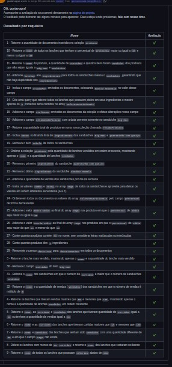

# Projeto Mongodb Commerce 

 ## Requisitos :robot:

- [x] 1 - Retorne a quantidade de documentos inseridos na coleção produtos
- [x] 2 - Ordene a coleção produtos pela quantidade de lanches vendidos em ordem crescente, mostrando apenas o nome e a quantidade de lanches vendidos
- [x] 3 - Retorne o lanche mais vendido, mostrando apenas o nome e a quantidade do lanche mais vendido
- [x] 4 - Retorne os lanches que tiveram vendas maiores que 50 e menores que 100, mostrando apenas o nome e a quantidade de lanches vendidos em ordem crescente
- [x] 5 - Retorne o nome, as curtidas e vendidos dos lanches que tiveram quantidade de curtidas igual a 36 ou tenham a quantidade de vendas igual a 85
- [x] 6 - Retorne o nome e as curtidas dos lanches que tiveram curtidas maiores que 10 e menores que 100
- [x] 7 - Retorne o nome e vendidos dos lanches que tenham sido vendidos com uma quantidade diferente de 50 e em que o campo tags não exista
- [x] 8 - Delete os lanches com menos de 50 curtidas e retorne o nome dos lanches que restaram no banco
- [x] 9 - Retorne o nome de todos os lanches que possuam calorias abaixo de 500
- [x] 10 - Retorne o nome de todos os lanches que tenham o percentual de proteínas maior ou igual a 30 e menor ou igual a 40
- [x] 11 - Retorne o nome do produto, a quantidade de curtidas e quantos itens foram vendidos dos produtos que não sejam iguais a Big Mac e McChicken
- [x] 12 - Adicione ketchup aos ingredientes para todos os sanduíches menos o McChicken, garantindo que não haja duplicidade nos ingredientes
- [x] 13 - Inclua o campo criadoPor em todos os documentos, colocando Ronald McDonald no valor desse campo
- [x] 14 - Crie uma query que retorne todos os lanches que possuem picles em seus ingredientes e mostre apenas os 3 primeiros itens contidos no array valoresNutricionais
- [x] 15 - Adicione o campo avaliacao em todos os documentos da coleção e efetue alterações nesse campo
- [x] 16 - Adicione o campo ultimaModificacao com a data corrente somente no sanduíche Big Mac
- [x] 17 - Retorne a quantidade total de produtos em uma nova coleção chamada resumoProdutos
- [x] 18 - Inclua bacon no final da lista de ingredientes dos sanduíches Big Mac e Quarteirão com Queijo
- [x] 19 - Remova o item cebola de todos os sanduíches
- [x] 20 - Remova o primeiro ingrediente do sanduíche Quarteirão com Queijo
- [x] 21 - Remova o último ingrediente do sanduíche Cheddar McMelt
- [x] 22 - Adicione a quantidade de vendas dos sanduíches por dia da semana
- [x] 23 - Insira os valores combo e tasty no array tags de todos os sanduíches e aproveite para deixar os valores em ordem alfabética ascendente (A a Z)
- [x] 24 - Ordene em todos os documentos os valores do array valoresNutricionais pelo campo percentual de forma decrescente
- [x] 25 - Adicione o valor muito sódio ao final do array tags nos produtos em que o percentual de sódio seja maior ou igual a 40
- [x] 26 - Adicione o valor contém sódio ao final do array tags nos produtos em que o percentual de sódio seja maior do que 20 e menor do que 40
- [x] 27 - Conte quantos produtos contém Mc no nome, sem considerar letras maiúsculas ou minúsculas
- [x] 28 - Conte quantos produtos têm 4 ingredientes
- [x] 29 - Renomeie o campo descricao para descricaoSite em todos os documentos
- [x] 30 - Remova o campo curtidas do item Big Mac
- [x] 31 - Retorne o nome dos sanduíches em que o número de curtidas é maior que o número de sanduíches vendidos
- [x] 32 - Retorne o nome e a quantidade de vendas (vendidos) dos sanduíches em que o número de vendas é múltiplo de 5

## Requisitos Aprovados 

